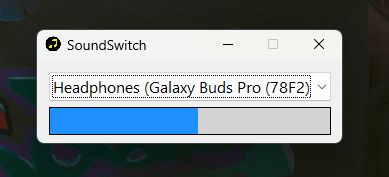
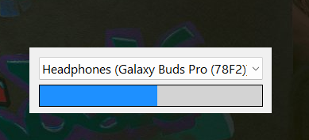

# 🎵 SoundSwitchWidget

A simple and efficient widget for Windows 11 that lets you **quickly switch between audio output devices** and **adjust the system volume** — all in one compact UI.

## ✨ Features

- 🔊 **Audio Output Switcher**  
  Easily select your desired audio device from a dropdown list (ComboBox) of currently available outputs.

- 📈 **Volume Control**  
  Adjust the system volume using a smooth mouse-drag-enabled progress bar (0–100%).

- ⚙️ **Popup Menu Options**  
  - **Start with Windows**  
  - **Stay on Top**

- 🧼 **Minimal UI**  
  - The title bar hides automatically when the widget is inactive to stay out of your way.
  - Lightweight and fast — the audio device list and volume level only refresh when the widget regains focus (via mouse), reducing unnecessary updates.

## 🖥️ Platform

- Designed for **Windows 11**
- Lightweight and runs in the background

## 🚀 Usage

1. Launch the app.
2. Select your audio output device from the dropdown.
3. Drag the volume slider to set your desired system volume.
4. Right-click to access additional options like autostart and stay-on-top behavior.